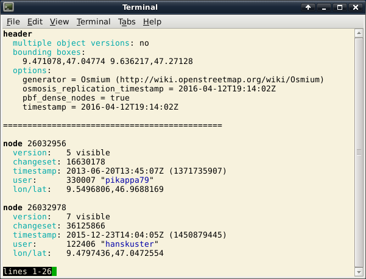

# Osmium Tool Manual

## Introduction

[Osmium](http://osmcode.org/osmium) is a versatile command line tool for
working with OpenStreetMap data. It includes many useful functions for
manipulating OSM data and often outperforms similar tools. This manual will
introduce the tool, give a general overview and describe some use cases. For
the nitty gritty detail consult the [manual
pages](http://docs.osmcode.org/osmium/latest/).

Osmium is Open Source and available under the GNU General Public License.
It works and is regularly tested on Linux, Mac OSX, and Windows.

Osmium is based on the C++ library [libosmium](http://osmcode.org/libosmium)
and it gets most of its functionality from it. If the command line tool doesn't
do something you need, have a look at the library. Maybe you can use it to
create a program that does what you want.

*Osmium is not complete. Of course most software will never be complete, but I
mention this here, because there are some glaring gaps in Osmium's
functionality, missing functions that would be useful for many people and that
would fit Osmium's mission as a general OSM data manging tool. They might be
missing because nobody thought of writing them, but more likely nobody did have
the time yet. Osmium, like most Open Source Software, is built piece by piece
based on what the author and others need. I some cases we haven't implemented
some functionality, because it is available somewhere else and while it would
be nice to have it in the same package, available alternatives make adding it a
lower priority. In any case, [tell
us](https://github.com/osmcode/osmium-tool/issues) if you need something.*

## Installation

### From source

You can download the
[latest release](https://github.com/osmcode/osmium-tool/releases/latest) or
install the current master from GitHub:

    git clone https://github.com/osmcode/osmium-tool

Follow the build and installation instructions in the
[README](https://github.com/osmcode/osmium-tool/blob/master/README.md).

### Debian and Ubuntu

Packages called `osmium-tool` are available for Debian and Ubuntu systems.
(Do not install the `osmium` package, it is a very old version of the Osmium
library.) Depending on your system, the packages might be rather old. Debian
unstable and testing are tracking the development of Osmium closely. For
Jessie those new packages are available in the
[backports repository](http://backports.debian.org/Instructions/).

### Fedora

Packages for several Fedora versions
[are available](https://admin.fedoraproject.org/pkgdb/package/rpms/osmium-tool/).

## The Osmium command

The starting point for everything is the `osmium` command. All the
functionality of Osmium is available via this one command and its
"subcommands", similar to how the `git` command works for instance. Just
calling

    osmium

will give you a list of subcommands. Use

    osmium COMMAND -h

to get a short description about a subcommand's options. Use

    osmium help COMMAND

to display the manual page explaining all the details. If Osmium is installed
correctly on your system, you can also get those manpages using the usual `man`
command:

    man osmium
    man osmium-fileinfo

etc.

The manpages are also available [on the web](http://docs.osmcode.org/osmium/latest/).

## Showing OSM files

Before you can do anything with an OSM file you'll often want to know what's in
that file. To find out run

    osmium fileinfo OSMFILE

Say you downloaded an extract of the tiny country of
[Liechtenstein](https://www.openstreetmap.org/relation/1155955)
(it is always good to start your experiments with a small extract)
from [Geofabrik](http://download.geofabrik.de/)
and want to know what's in it:

    osmium fileinfo liechtenstein-latest.osm.pbf

This will show you something like the following:

    File:
      Name: liechtenstein-latest.osm.pbf
      Format: PBF
      Compression: none
      Size: 1532846
    Header:
      Bounding boxes:
        (9.47108,47.0477,9.63622,47.2713)
      With history: no
      Options:
        generator=Osmium (http://wiki.openstreetmap.org/wiki/Osmium)
        osmosis_replication_timestamp=2016-04-12T19:14:02Z
        pbf_dense_nodes=true
        timestamp=2016-04-12T19:14:02Z

The `File` section contains the information gleaned from the file system,
the `Header` section contains, as the name implies, the information from the
file header. To get some more detail use the `-e` or `--extended` flag:

    osmium fileinfo -e liechtenstein-latest.osm.pbf

In this case the whole file will be read, which will take more time. But it
gives you a lot more information:

    File:
      Name: liechtenstein-latest.osm.pbf
      Format: PBF
      Compression: none
      Size: 1532846
    Header:
      Bounding boxes:
        (9.47108,47.0477,9.63622,47.2713)
      With history: no
      Options:
        generator=Osmium (http://wiki.openstreetmap.org/wiki/Osmium)
        osmosis_replication_timestamp=2016-04-12T19:14:02Z
        pbf_dense_nodes=true
        timestamp=2016-04-12T19:14:02Z
    Data:
      Bounding box: (9.39778,46.9688,9.67146,47.5258)
      Timestamps:
        First: 2007-06-19T06:25:12Z
        Last: 2016-04-11T07:49:32Z
      Objects ordered (by type and id): yes
      Multiple versions of same object: no
      CRC32: 727f1abf
      Number of changesets: 0
      Number of nodes: 168683
      Number of ways: 18784
      Number of relations: 374
      Largest changeset ID: 0
      Largest node ID: 4112691184
      Largest way ID: 409348773
      Largest relation ID: 6122095

Sometimes your are only interested in a specific piece of information from this
list. Use the `-g`, `--get` option to ask for it. For instance to get the last
timestamp used:

    osmium fileinfo -e -g data.timestamp.last liechtenstein-latest.osm.pbf

This will result in just the timestamp:

    2016-04-11T07:49:32Z

This format makes it easy to use the output in other shell commands. To put the
CRC32 checkum into the `checksum` shell variable you can use the following
command, for instance:

    checksum=$(osmium fileinfo -e -g data.crc32 $filename)

Of course you might also want to look at the contents of the file. For a quick
look, use the `show` command:

    osmium show liechtenstein-latest.osm.pbf

This will show the contents of the file in the *debug* format (more on the
different formats below) using your favourite pager (`less` by default):

This *debug* format is intended to be easy to read, on terminals that support
it, colors make it even easier. But you can change the output format to any
format supported by Osmium.

## OSM file formats and converting between them

Osmium supports all popular OSM file formats (and some more): XML, PBF,
O5M/O5C, OPL, and the already mentioned *debug* format. Some formats can
only be read or only be written. See the
[osmium-file-formats](http://docs.osmcode.org/osmium/latest/osmium-file-formats.html)
man page for details. All the text-based formats can be automatically
(de)compressed if they use the `gzip` or `bzip2` compression.

Often you need to convert OSM data files from one format to another. This
is easily done with the `osmium cat` command. To convert the Liechtenstein
PBF file into XML format compressed with `bzip2`, use this command:

    osmium cat liechtenstein-latest.osm.pbf -o liechtenstein.osm.bz2

Osmium will automatically detect the file format based on the file name.
Usually it will do what you want, but you can force the file format with
the command line options `-f` (for the output file) and `-F` for the input
file. This is useful when reading from STDIN or writing to STDOUT:

    osmium cat input.osm.pbf -f osm | some_program_reading_osm_xml

The format for the `-f` and `-F` options is simply the suffix you would usually
use for an OSM file (here `osm`). It also works with `pbf` (or `osm.pbf`),
`osm.gz` etc.

Most file formats have special options to change the details of the file
format. You can set those special options with the same command line options.
For instance, if you want a bz2ip-compressed XML file without metadata use
this:

    osmium cat input.osm.pbf -o output.osm.bz2 -f osm.bz2,add_metadata=false

The output file will not have the `version`, `timestamp`, etc. fields and so
it is much more compact than the usual XML format.

As you can see you can add the options to the format separated by commas,
multiple options are possible. Some options are available for several or all
formats (`add_metadata` for instance), others are specific to one of the
formats, `pbf_dense_nodes` for instance only works on the PBF format. Note
that unknown options are silently ignored, so if you mistype an option, you
will not get an error message.

See the
[osmium-file-formats](http://docs.osmcode.org/osmium/latest/osmium-file-formats.html)
man page for all the details. Btw: all these file formats and options are
implemented in the [libosmium library](http://osmcode.org/libosmium/), so most
libosmium-based programs will understand them in the same fashion.

While playing around with the command you might have noticed an error
message like `Open failed for 'output.osm.bz2': File exists`. By default
Osmium will not overwrite an existing file. This is a safety measure to
keep you from accidentally deleting that 30GB planet file, that took you
all day to download. With the `-O` or `--overwrite` option you can disable
this check.

The `osmium cat` command can do more: Just like the shell `cat` command, it
can take several input files and it will concatenate them to generate the
output. In fact that's where the name (con"cat"enate) comes from. Its ability
to convert from one file format to another is only a side-effect really, most
Osmium subcommands can read and write OSM files in any format and support the
same `-f` and `-F` options. Note that this command will really just
concatenate its inputs and not sort them in any way. This might or might not
be what you want.

There is one additional option of the `osmium cat` command that often comes
handy. With `-t TYPE` it can be instructed to only copy objects of the given
type. So

    osmium input.osm.pbf -t node -o output.osm.pbf

will only copy the nodes, not the ways, or relations.

## Verbose mode

Most Osmium commands support the `-v` or `--verbose` command line option to
enable *verbose* mode. Osmium will then display information about its command
line parameters and about what it is doing to STDERR.

Each line of the output is started with the elapsed time in minutes and
seconds. This is especially useful when Osmium is run in scripts and the
output is logged, you can immediately see where the time went.

In verbose mode, most Osmium commands will also display the memory used. This
is handy because Osmium command often need a lot of memory to efficiently do
their job. There is also a `MEMORY` section in each of the man pages that
tells you about memory use of this particular command.

## Getting OSM objects by ID

Sometimes you have the ID of a node, way or relation (or a bunch of IDs) and
want to get the objects with those IDs from a file. That's what the `getid`
command is for. The following command will get the nodes 17 and 18, the way
42, and the relation 3 out of the file:

    osmium getid input.osm.pbf n17 n18 w42 r3 -o output.osm.pbf

As you can see the IDs are written with a one-letter prefix denoting the type.
IDs without this prefix are understood to be node IDs (but this can be changed
with the `--default-type` option).

If you have more than a few IDs you can put them into a file, one ID per line
and use the `-i` option to read them from that file:

    osmium getid input.osm.pbf -i ids -o output.osm.pbf

Empty lines and everything after a space or hash (#) sign is ignored. And you
can read from STDIN. So this command

    echo "r123 foo bar" | osmium getid input.osm.pbf -i - -f debug

will find the relation with the ID 123 in `input.osm.pbf` and output it to
STDOUT in debug format.

Often you need not only the OSM objects with the given IDs but also all
objects referenced by those objects. So for ways you need the nodes in it
and for relations the members. Use the `-r` or `--add-referenced` option to
add them to the output:

    osmium getid -r input.osm.pbf w222 -o output.osm.pbf

The output will contain first all nodes references by way 222 and then the
way. The `getid` command will read the input file up to three times to
follow all the references. Output will be sorted in the usual fashion: first
nodes ordered by ID, then ways, then relations.

## Checking references

A full planet dump is referentially complete. All objects referenced by other
objects are in the file. So if a relation has a member way 123, then this way
will also be in the file. This is not always true for geographical extracts or
other partial OSM files.

This often leads to confusion. Many programs that use OSM data will fail
in unexpected ways when something is missing in its input data. If you have
a situation like this you can use the `check-refs` command to find out whether
your OSM file is referentially complete:

    osmium check-refs input.osm.pbf

This command will check that all nodes referenced in the ways are in the input
file. If you want to check relation members, too, use the `-r` or
`--check-relations` option.

## Working with History Files

Osmium can not only work with normal OSM data files, but also with history
files. History files look more or less like normal OSM data files, but they
can contain several versions of the same object. The [full history planet
dump](http://planet.osm.org/planet/full-history/) contains all versions of all
objects that ever existed in the OSM data.

Most programs using OSM data expect object IDs to be unique, so they can not
work with history data. The same is true for some Osmium subcommands. But
wherever it is possible and makes sense, Osmium also supports history files.
Often they will just work, sometimes you need special command line options.

Commands that "just work" are `cat`, `fileinfo`, `show`, `sort`. The will do
what you expect.

One command is only useful for history files: `time-filter`. It is used to
filter objects from a history file based on time. To get all objects visible
at a point in time use a command line like this:

    osmium time-filter history.osm.pbf 2015-01-01T00:00:00Z -o 2015.osm.pbf

The output is a normal OSM data file containing the data as it would have
looked at the start of the year 2015 (UTC time as always with OSM).

## Working with Changesets

Osmium can not only handle OSM objects (nodes, ways, and relations), but also
OSM changesets. Those changesets are also stored in files with the suffix
`.osm`, which can make things somewhat confusing. Some Osmium commands will
just work on changeset files: `osmium fileinfo`, `osmium show`, and
`osmium cat`. Others don't make any sense with changeset files, like
`apply-changes`.

Unlike OSM data files for which several formats are available (XML, PBF,
O5M, ...) changesets always come in XML format which is much slower to work
with than the binary formats.

There is one command specifically for changeset files: `changeset-filter`.
You can use it to select changesets from a file. If you want to get all
changesets by user "Einstein", for instance, you'd use this command:

    osmium changeset-filter -u Einstein changesets.osm.bz2 -o einstein.osm.bz2

Have a look in the
[man page](http://docs.osmcode.org/osmium/latest/osmium-changeset-filter.html)
to see the other options available. You can also combine several of them to
only get those changesets matching all criteria.

Changesets can also be written out into the OPL format which can be processed
easily with standard unix command line tools. Say you have a list of user names
and want to find all changesets in January 2015 by any of those users. You can
first use `changeset-filter` to filter out the time window and then use `grep`
to check for those users:

    osmium changeset-filter -a 2015-01-01T00:00:00Z -b 2015-01-31T23:59:59T \
        -f opl | grep ' u\(foo\|bar\|baz\) '

This way you can use the fast, but not very flexible filtering options of the
`changeset-filter` command together with slower, but more flexible filtering
using unix command line tools or scripting languages.

## Sorting OSM files

OSM files are usually sorted in a specific way: First the nodes ordered by
ID, then ways ordered by ID, then relations ordered by ID. But this is not
necessarily so. `osmium fileinfo` will tell you if a file is sorted or not:

    > osmium fileinfo -e input.osm.pbf
    ...
    Objects ordered (by type and id): yes
    ...

Many commands (Osmium or otherwise) only work correctly if the file is sorted.
Sorting a file is easy:

    osmium sort input.osm.pbf -o output.osm.pbf

Note that `osmium sort` reads the contents of the input file into main memory.
This will take roughly 10 times as much memory as the files take on disk in
.osm.bz2 or osm.pbf format. So this command is only useful for smaller OSM
files.

Osmium sort will work correctly on history and change files.

### Command Line Completion

There is a command line completion configuration available for Zsh users. This
allows comfortable command line completion of all Osmium commands including
command line options. If you have installed Osmium as a Debian package, it
will be installed for you. If you built and installed from sources, you need
to install the file `zsh_completion/_osmium` yourself, for instance in
`/usr/local/share/zsh/site-functions/`.

